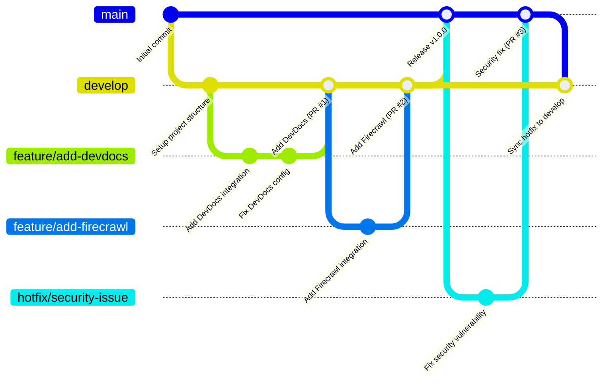

# Git Workflow Standards for Unified Knowledge Management System

## 🌿 Branch Strategy

### Main Branches
- `main`: Production-ready code, protected
- `develop`: Integration branch for features, protected

### Feature Branches
- Naming: `feature/short-description`
- Branch from: `develop`
- Merge to: `develop` via PR

### Bugfix Branches
- Naming: `bugfix/issue-number-description`
- Branch from: `develop`
- Merge to: `develop` via PR

### Hotfix Branches
- Naming: `hotfix/issue-number-description`
- Branch from: `main`
- Merge to: `main` AND `develop` via PR

## 📝 Commit Strategy

We use **Conventional Commits** for all code changes:

```
<type>[optional scope]: <description>

[optional body]

[optional footer(s)]
```

### Types
- `feat`: New feature
- `fix`: Bug fix
- `docs`: Documentation changes
- `style`: Formatting changes
- `refactor`: Code change that neither fixes a bug nor adds a feature
- `perf`: Performance improvements
- `test`: Adding or correcting tests
- `build`: Changes to build system or dependencies
- `ci`: Changes to CI configuration
- `chore`: Other changes that don't modify src or test files

### Scopes
- `devdocs`: DevDocs component
- `firecrawl`: Firecrawl component
- `qdrant`: Qdrant vector database
- `kg`: Knowledge Graph component
- `obsidian`: Obsidian integration
- `search`: Unified Search Engine
- `gateway`: Supergateway component
- `client`: Client configurations
- `docs`: Documentation files
- `infra`: Infrastructure components

### Examples
```
feat(search): add vector similarity search to unified engine

Implements vector similarity search using cosine distance in the Unified Search Engine.
This improves search accuracy for technical documentation.

Resolves: #42
```

```
fix(qdrant): correct connection timeout issue

Increases timeout parameter to prevent connection failures under load.

Fixes: #53
```

## 🔄 Pull Request Process

1. **Create PR**
   - Fill out PR template completely:
     ```markdown
     ## Description
     Brief description of the changes

     ## Related Issues
     Fixes #XX

     ## Type of Change
     - [ ] New feature
     - [ ] Bug fix
     - [ ] Documentation update
     - [ ] Performance improvement
     - [ ] Code refactor
     - [ ] Other (please describe)

     ## Testing Performed
     Description of testing done

     ## Screenshots (if applicable)

     ## Checklist
     - [ ] Code follows project style guidelines
     - [ ] Documentation has been updated
     - [ ] Tests have been added/updated
     - [ ] All tests pass
     ```
   - Assign reviewers (minimum 1 required)
   - Link related issues
   - Add appropriate labels

2. **Review Requirements**
   - All automated tests must pass
   - Code review approval required from at least one maintainer
   - No merge conflicts
   - Documentation updated if applicable
   - All PR comments addressed

3. **Merge Strategy**
   - We use "Squash and merge" for feature branches
     - PR title follows conventional commit format
     - PR description becomes commit body
   - We use "Create a merge commit" for hotfix branches
     - Merge commit title follows conventional commit format
     - PR description becomes commit body

4. **Cleanup**
   - Delete branch after merging
   - Close related issues automatically with keywords in PR

## 🔍 Code Review Standards

- Review within 24 hours of assignment
- Be constructive and respectful
- Focus on:
  - Functionality: Does it work as intended?
  - Security: Is it secure?
  - Performance: Is it efficient?
  - Readability: Is it easy to understand?
  - Test coverage: Is it adequately tested?
  - Documentation: Is it well-documented?
- Provide specific feedback with suggestions
- Use GitHub review features (suggestions, approvals, etc.)
- Distinguish between required changes and optional improvements

## 🚀 Deployment Process

1. Changes merged to `develop` trigger automated tests
   - Includes unit tests, integration tests, and E2E tests
   - Build artifacts created and stored
   - Development environment updated

2. Changes merged to `main` trigger production deployment
   - Production build created
   - Artifacts deployed to production environment
   - Post-deployment tests run automatically

3. Tag releases using semantic versioning: `v1.2.3`
   - Created automatically for `main` branch merges
   - Release notes generated from commit messages
   - GitHub release created with artifacts

## 📊 Issue Management

- Use GitHub Issues for tracking all work
- Label issues appropriately:
  - `bug`: Something isn't working
  - `enhancement`: New feature or request
  - `documentation`: Documentation improvements
  - `performance`: Performance improvements
  - `refactor`: Code refactoring
  - `test`: Test improvements
  - `question`: Further information is needed
  - `component: [name]`: Affected component

- Prioritize using labels:
  - `priority: critical`: Must be fixed ASAP
  - `priority: high`: Should be fixed in current sprint
  - `priority: medium`: Should be fixed soon
  - `priority: low`: Nice to have

- Use project boards for sprint planning
- Reference issues in commits and PRs using keywords:
  - `Fixes #42`: Closes issue when PR is merged
  - `Relates to #42`: Creates a reference without closing

## 🔄 Continuous Integration

- All PRs trigger automated tests
  - Unit tests for individual components
  - Integration tests for component interactions
  - End-to-end tests for complete system
  - Performance benchmarks for critical paths

- Code quality checks run on every push
  - Linting for consistent code style
  - Static analysis for potential issues
  - Dependency vulnerability scanning
  - Documentation coverage

- Performance benchmarks for significant changes
  - Search performance metrics
  - Indexing performance metrics
  - Memory usage metrics
  - API response time metrics

## 🔐 Security Practices

- Regular dependency updates
- Security scanning in CI pipeline
- Secrets management (no hardcoded credentials)
- Code reviews focused on security aspects
- Regular security audits

## 📚 Documentation Standards

- All code changes require documentation updates
- API changes must update API reference docs
- New features require user guide updates
- Architecture changes require diagram updates
- Use Markdown for all documentation

## 🧪 Testing Standards

- Unit tests required for all new code
- Integration tests for component interactions
- End-to-end tests for critical paths
- Test coverage targets:
  - 80% line coverage minimum
  - 100% coverage for critical components
- Performance tests for search and indexing

---

This workflow ensures consistent, high-quality code contributions while maintaining project stability and facilitating collaboration.


